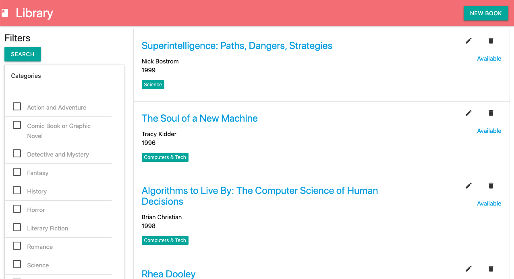

### Library Project

A web application to search books in a library.

#### Requirements

- [PHP 7](https://www.php.net/downloads.php)
- [Composer](https://getcomposer.org/)
- [Laravel 5.4](https://laravel.com/docs/5.4/installation)
- [MySQL Server (community edition)](https://dev.mysql.com/downloads/mysql/)

#### Database configuration

Open a terminal in your operating system. Write the follow setences:

Connecting to the MySQL Server. Use you root user and password

    mysql -u root -p

Create database for the library system

    create database library;

Create database user 

    create user 'admin'@'localhost' identified by 'secret'

Grant all permissions to this user

    grant all privileges on library.* to 'admin'@'localhost';

#### How to run the app

Open a terminal in your operating system. Write the follow setences:

Download project git repository 

    git clone https://github.com/elbarbaro/library.git

Enter to the project directory

    cd library

Download the project dependecies

    php composer.phar install

Create tables with default entries in them

    php artisan migrate --seed

Run the server

    php artisan serve

Open you browser in the url [http:localhost:8000](http:localhost:8000) (make you sure don't use this port).

# It's works!

Now you create, update, delete books and see them in the list,  you can to do more. Thanks and happy coding 😊

## License

The library project is open-sourced software licensed under the [MIT license](http://opensource.org/licenses/MIT).
